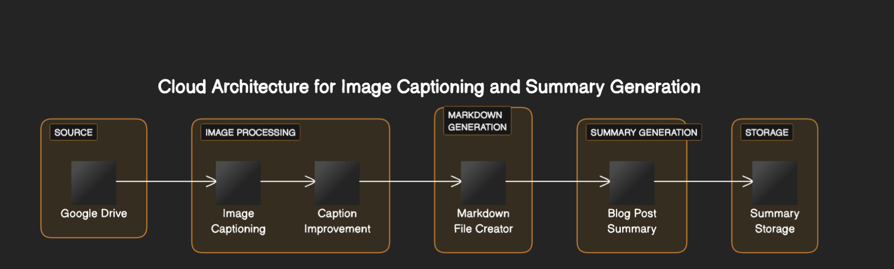

# Google Drive Image Caption Enhancement

This Python script interacts with Google Drive, retrieves image files, and enhances their captions using various AI models provided by Google Cloud Platform (GCP) Vertex AI.

## Overview

The script performs the following actions:

1. **Initialization:**
   - Sets up logging and environment variables for configuration.
   - Initializes GCP Vertex AI for image and text processing.

2. **Functions:**
   - `download_image`: Downloads image content from Google Drive.
   - `convert_heic_to_png`: Converts HEIC images to PNG format.
   - `process_captions_async`: Processes captions asynchronously using a text generation AI model.
   - `process_image_caption_async`: Retrieves captions from images asynchronously using an image text model.
   - `process_images`: Processes images and their captions in parallel.
   - `get_all_files_from_drive`: Retrieves all image files from a specified Google Drive folder.
   - `chunks`: Splits a list into smaller chunks.

3. **Execution:**
   - Fetches image files from Google Drive.
   - Processes images and their captions, generating improved captions using Vertex AI Vision.
   - Creates a Markdown file containing the improved captions using Vertex AI Text model predict.
   - Generates a summary for a blog post based on the captions.
   - Store the summary file in the GCP Drive folder

4. **High Level:**

## Usage

1. Set up the necessary environment variables:
   - `CAPTION_SHORT_TEXT_CONTEXT`: Context for caption enhancement.
   - `GCP_PROJECT_ID`: GCP project ID.
   - `GCP_DRIVE_FOLDER_ID`: Google Drive folder ID.
   - `GCP_DRIVE_FETCH_PAGE_SIZE`: Page size for fetching files (default is 100).

2. Run the script `python images_ai_blog_generator.py`.

## Requirements

- Python 3.x
- Google Cloud Platform (GCP) account and API credentials
- Installed Python packages: `google-cloud-aiplatform`, `google-api-python-client`, `Flask`, `heic2png`, `google-auth`

## Configuration

1. Obtain service account credentials for GCP.
2. Set up the `client_secrets.json` file.
3. Update environment variables or use default values in the script.

## Deployment to Google Cloud Run

To automatically deploy this Python script as a containerized application on Google Cloud Run directly from your GitHub repository, follow these steps:

1. **Prepare your GitHub repository:**

   Ensure your GitHub repository contains the necessary files:
   - Dockerfile: Configured to build your Python script and dependencies into a Docker container.
   - Required configuration files (if any).
   - Service account key files (if necessary and handled securely).

2. **Set up Cloud Run and Cloud Build:**

   - Open the Google Cloud Console.
   - Enable the necessary APIs: Cloud Build, Cloud Run, and Container Registry.
   - Set up the Cloud Run service manually or through the Cloud Console to configure settings like authentication, memory, CPU, etc.
   - Configure Cloud Build triggers:
     - Go to Cloud Build > Triggers.
     - Click "Connect Repository" and select your GitHub repository.
     - Configure trigger settings (e.g., branch, tag, trigger type, build configuration file path).

3. **Configure build settings:**

   - Create a cloudbuild.yaml file in your repository to define the build steps.
   - Include build steps to build the Docker image, push it to Container Registry, and deploy to Cloud Run.

4. **Trigger deployment:**

   - Commit and push changes to your GitHub repository.
   - Cloud Build automatically detects changes based on the configured trigger and initiates the build and deployment process.

Remember to ensure your script handles secrets and sensitive information securely. Also, verify that your Cloud Run service account has the necessary permissions to interact with Google Drive, Vertex AI, and other required GCP services.

This process involves setting up continuous deployment with Cloud Build triggers, which automatically builds and deploys changes from your GitHub repository to Cloud Run.

For more detailed instructions or troubleshooting, refer to the Cloud Run and Cloud Build documentation.

## License

This project is licensed under the [MIT License](LICENSE).

Feel free to contribute or raise issues.

For more details, refer to the script documentation.

